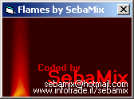



## GFX\_Fire \- A fire demo

### Description

This code will draw on a form an animated flame, using a simple algorithm. I don't use any API declaration, so I use only standard VB functions.

The code is full commented (sorry my english) and there are 61 line of code only;

If you like it please vote (^_^)! Or leave a useful comment (better thing)!
 
### More Info
 
The code can be slow on older machines;

             |
---                |---
**Submitted On**   |2002-01-04 12:46:12
**By**             |[Sebastiano Pallaro](https://github.com/Planet-Source-Code/PSCIndex/blob/master/ByAuthor/sebastiano-pallaro.md)
**Level**          |Intermediate
**User Rating**    |4.9 (54 globes from 11 users)
**Compatibility**  |VB 5\.0, VB 6\.0
**Category**       |[Graphics](https://github.com/Planet-Source-Code/PSCIndex/blob/master/ByCategory/graphics__1-46.md)
**World**          |[Visual Basic](https://github.com/Planet-Source-Code/PSCIndex/blob/master/ByWorld/visual-basic.md)
**Archive File**   |[GFX\_Fire\_\-46212142002\.zip](https://github.com/Planet-Source-Code/sebastiano-pallaro-gfx-fire-a-fire-demo__1-30373/archive/master.zip)

### API Declarations

Nope

